# 🍔 Food Ordering Platform - End-to-End DevOps Project

## 📌 Project Overview

This project demonstrates a complete end-to-end DevOps workflow for a microservices-based Food Ordering Platform.

The application consists of multiple independent services containerized using Docker and deployed to a Kubernetes cluster (K3s) running on an AWS EC2 instance. Continuous Integration and Continuous Deployment (CI/CD) are automated using Jenkins, while Helm is used to simplify Kubernetes application deployment and management.

---

## 🏗️ Architecture Diagram


---

## 🚀 Technologies Used

- **Frontend:** React.js
- **Backend:** Node.js, Express.js
- **Database:** MongoDB
- **Message Broker:** RabbitMQ
- **Version Control:** Git & GitHub
- **CI/CD:** Jenkins
- **Containerization:** Docker
- **Container Registry:** Docker Hub
- **Container Orchestration:** Kubernetes (K3s)
- **Package Manager:** Helm
- **Cloud Platform:** AWS EC2

---

## ⚙️ CI/CD Workflow

1. Developer pushes source code changes to GitHub.
2. Jenkins automatically triggers the pipeline.
3. Jenkins builds Docker images for all microservices.
4. Images are pushed to Docker Hub.
5. Jenkins connects to AWS EC2 via SSH.
6. Helm deploys/updates the application on Kubernetes.
7. Kubernetes performs rolling updates.

---

## 📁 Repository Structure

```text
food-ordering-platform/
│
├── frontend/
├── api-gateway/
├── user-service/
├── restaurant-service/
├── order-service/
│
├── k8s/
│
├── helm/
│   └── food-ordering-chart/
│
├── docker-compose.yml
├── Jenkinsfile
└── README.md
```

---

# 🔄 Jenkins CI/CD Pipeline

## Jenkins Dashboard

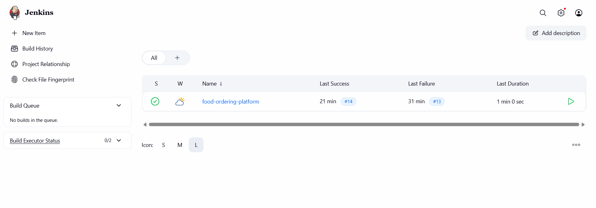

---

## Successful Pipeline Execution

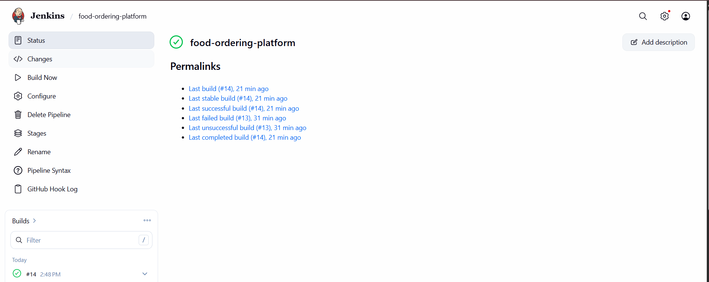

---

## Jenkins Console Output

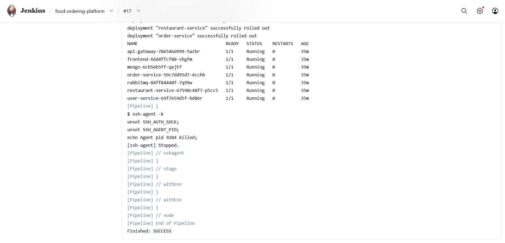

---

# 🐳 Docker Hub Images

All microservice Docker images are stored in Docker Hub.

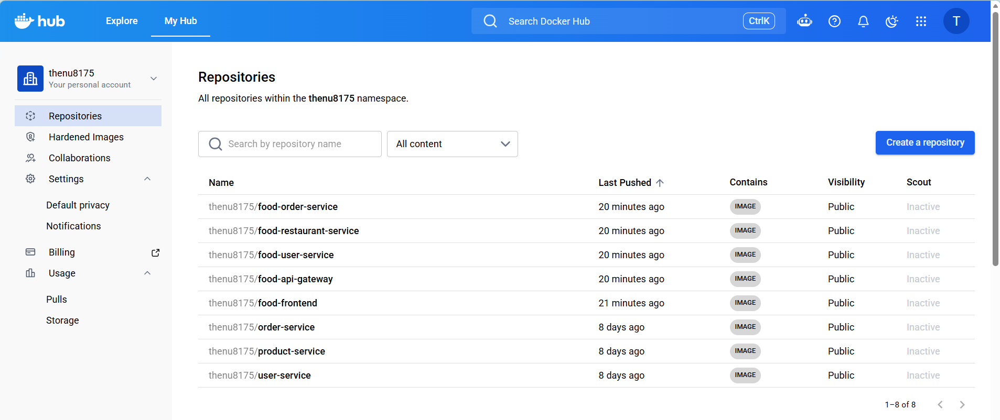

---

# ☸️ Kubernetes Deployment

## Kubernetes Cluster Resources

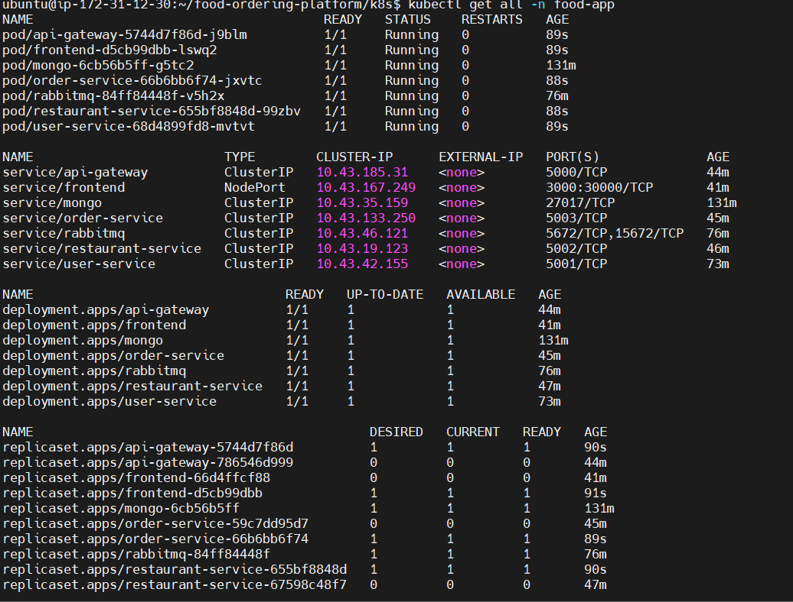

---

## Running Pods

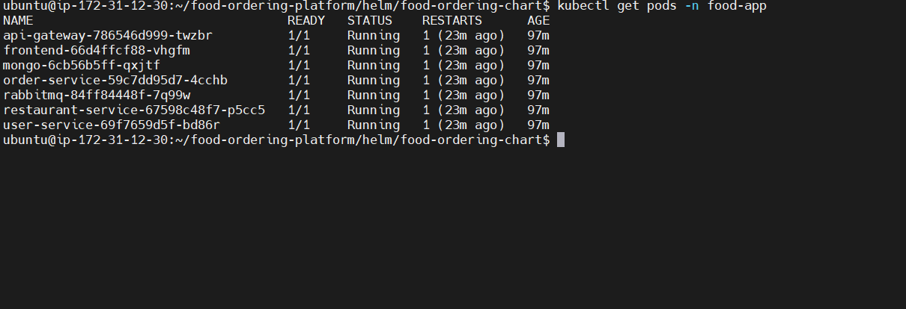

---

## Kubernetes Services

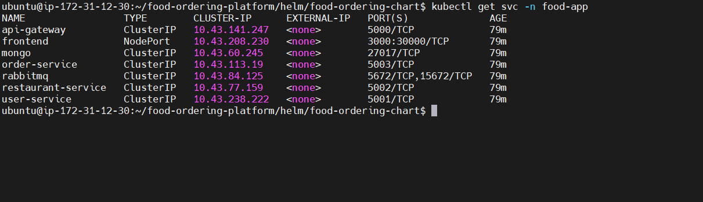

---

## Kubernetes Namespace


---

## K3s Cluster Node

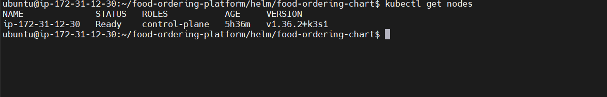

---

# ⎈ Helm Deployment

Helm is used to package and deploy Kubernetes resources.

```bash
helm upgrade --install food-app ./helm/food-ordering-chart -n food-app
```

## Helm Release

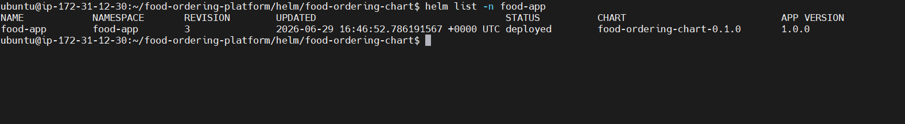

---

# ☁️ AWS Deployment

Application workloads are hosted on an AWS EC2 Ubuntu instance.

## Security Group Configuration

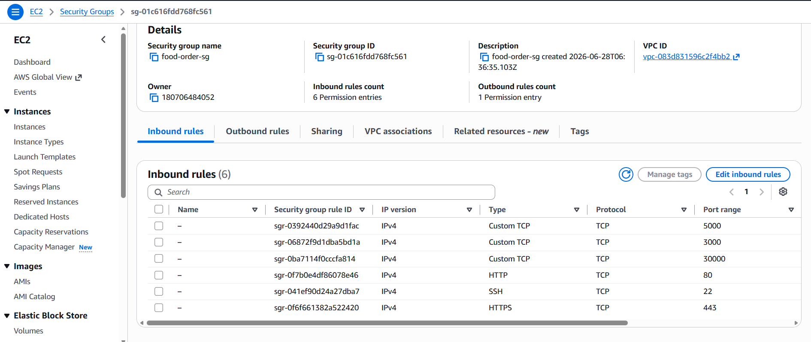

---

# 🖥️ Application Screenshots

## Login Page

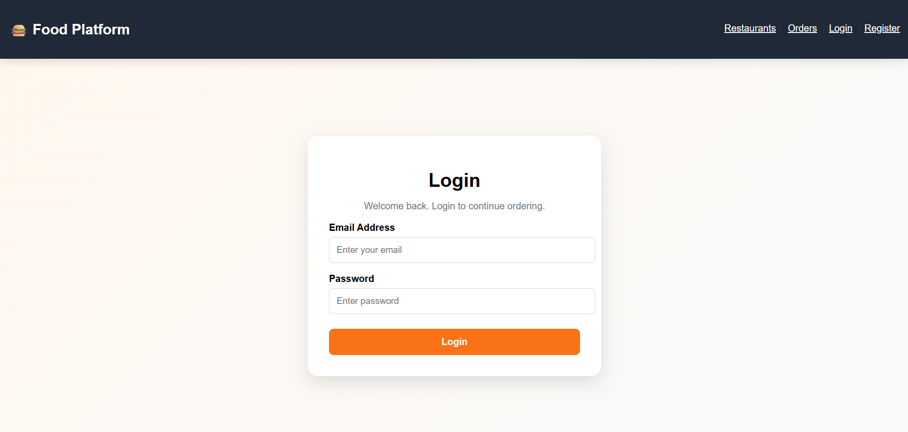

---

## User Registration

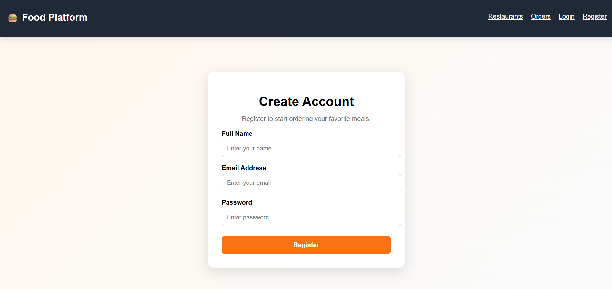

---

## Restaurant Listing

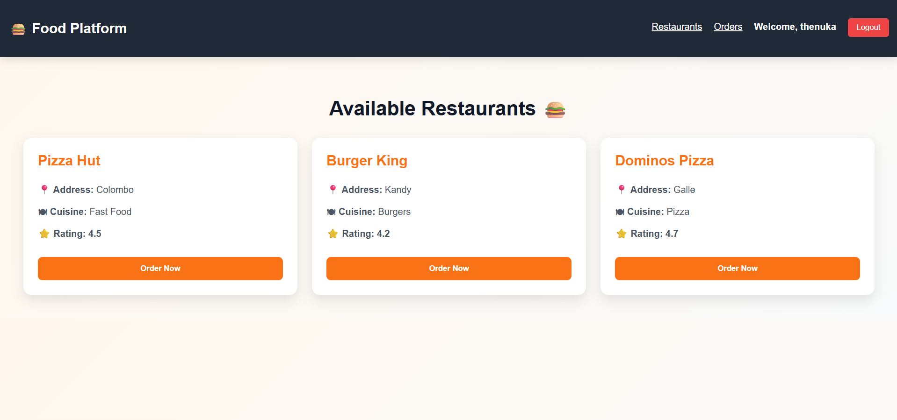

---

## Order Management

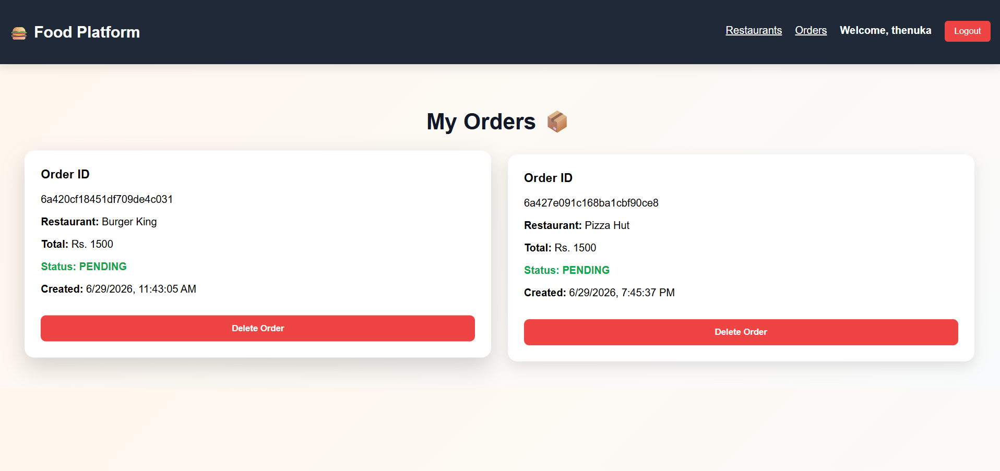

---

# 🚀 Deployment Steps

## Clone Repository

```bash
git clone https://github.com/<your-github-username>/food-ordering-platform.git
cd food-ordering-platform
```

---

## Build Docker Images

```bash
docker build -t thenu8175/food-frontend ./frontend
docker build -t thenu8175/food-api-gateway ./api-gateway
docker build -t thenu8175/food-user-service ./user-service
docker build -t thenu8175/food-restaurant-service ./restaurant-service
docker build -t thenu8175/food-order-service ./order-service
```

---

## Push Images to Docker Hub

```bash
docker push thenu8175/food-frontend
docker push thenu8175/food-api-gateway
docker push thenu8175/food-user-service
docker push thenu8175/food-restaurant-service
docker push thenu8175/food-order-service
```

---

## Deploy Using Helm

```bash
helm upgrade --install food-app ./helm/food-ordering-chart -n food-app
```

---

# ✅ Key DevOps Features Implemented

- Jenkins CI/CD Pipeline
- Docker Image Automation
- Docker Hub Integration
- Kubernetes (K3s) Orchestration
- Helm-Based Deployments
- Rolling Updates
- Microservices Architecture
- AWS EC2 Deployment
- Automated Application Delivery

---

# 🔮 Future Enhancements

- Prometheus Monitoring
- Grafana Dashboards
- ArgoCD GitOps Deployment
- Kubernetes Ingress Controller
- TLS/HTTPS with Cert Manager
- Horizontal Pod Autoscaling (HPA)

---

# 👨‍💻 Author

**Thenuka**

DevOps Enthusiast | Undergraduate | Cloud & Automation Learner